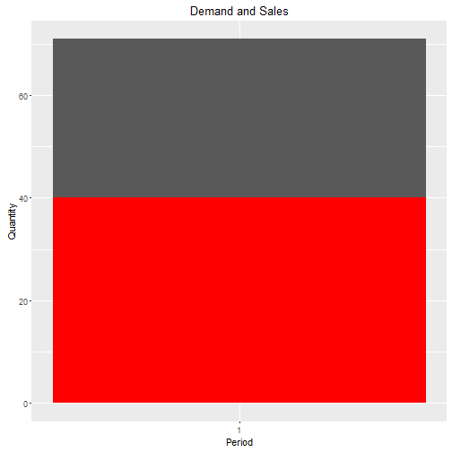

## Overview

The year has passed. The macroparameters of the market were as follows:



| Period|Weather.Conditions |Economic.Conditions | Demand| Sales| Total.Revenue| Mean.Salary| Total.Stock|
|------:|:------------------|:-------------------|------:|-----:|-------------:|-----------:|-----------:|
|      1|excelent           |decrease            |     71|    40|         222.3|           1|           0|

### Newsletter
Messages on production chain

```
## [1] "Total stock in supply chain for the next period equals 18 units"
```

## Players Results
### Planter Results

| Period| Cash| Loan.Interest| Fields| Machinery| Labor| Salary| Stock| Production| Sales| Price| Revenue|
|------:|----:|-------------:|------:|---------:|-----:|------:|-----:|----------:|-----:|-----:|-------:|
|      1|    0|             0|      1|         2|    10|     10|    10|         50|    50|     1|      50|
|      2|   37|             0|      1|         0|     0|      0|    10|          0|     0|     0|       0|

```
## [1] "No messages for today"
```

### Roaster Results

| Period| Cash| Loan.Interest| Pans| Labor| Salary| Supply| Stock| Production| Sales| Price| Revenue|
|------:|----:|-------------:|----:|-----:|------:|------:|-----:|----------:|-----:|-----:|-------:|
|      1|  0.0|             0|    2|    10|     10|     50|    10|         45|    46|   1.2|    55.2|
|      2| -7.8|             0|    0|     0|      0|      0|     0|          0|     0|   0.0|     0.0|

```
## [1] "No messages for today"
```

### Packer Results

| Period| Cash| Loan.Interest| Lines| Labor| Salary| Supply| Stock| Production| Sales| Price| Revenue|
|------:|----:|-------------:|-----:|-----:|------:|------:|-----:|----------:|-----:|-----:|-------:|
|      1|  0.0|             0|     2|    10|     10|     50|    10|         46|    47|   1.3|    61.1|
|      2| -7.1|             0|     0|     0|      0|      0|     0|          0|     0|   0.0|     0.0|

```
## [1] "No messages for today"
```

### Retailer Results

| Period|  Cash| Loan.Interest| POS| Labor| Salary| Supply| Stock| Sales| Price| Revenue|
|------:|-----:|-------------:|---:|-----:|------:|------:|-----:|-----:|-----:|-------:|
|      1|   0.0|             0|   2|    10|     10|     50|    10|    40|   1.4|      56|
|      2| -18.1|             0|   0|     0|      0|      0|     8|     0|   0.0|       0|

```
## [1] "No messages for today"
```

